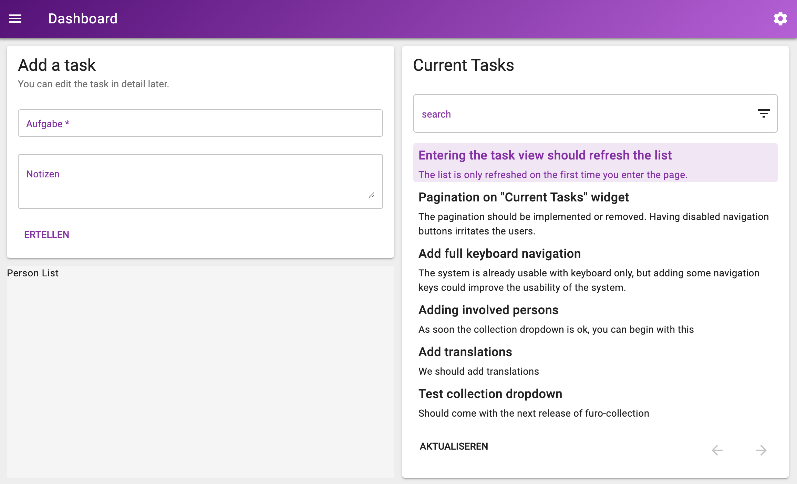
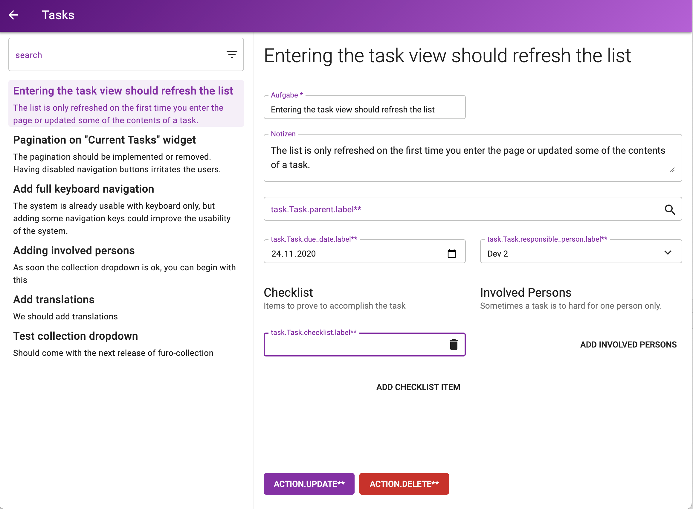

# todo server

user: demo password: 1234

To start the server just type `go run cmd/server/main.go` and visit http://localhost:10000.

This is the server for the example app. This repo is made for educational purposes only. It is not our idea to show how
to build a server. Our intention is showing the connections of all parts.

The build scripts are calling some other repositorys directly (../todo-client, ../todo-specs). We omitted the usage of a
build pipeline for simplicity.

### What you should see



---



### The API

The api serves the specified services from the **todo-spec** project.

You cann access the api on *:10000* with */api* as prefix or on *:7001* without a prefix.

## Overview

This server exposes

- the grpc API for the grpc-gateway :7000
- the grpc gateway (aka transcoder) :7001
- the webserver to serve the client :10000

Usually this would be done on a server for each service, but for **simplicity** the transcoder and the client is built
in.

```

    :10000
   +-------------------------+
   |                         |
   |       todo-client       |  <-----------------+
   |       (webserver)       |                    |
   +-------------------------+                    |
                |                         +----------------+
    :7001       v                         |   todo-specs   |
   +-------------------------+            +----------------+
   |                         |                    |
   |       grpc gateway      |  <-----------------+
   |                         |                    |
   +-------------------------+                    |
                |                                 |
    :7000       v                                 |
   +-------------------------+                    |
   |                         |                    |
   |       todo-server       |  <-----------------+
   |     ----------------    |
   +-------------------------+


```